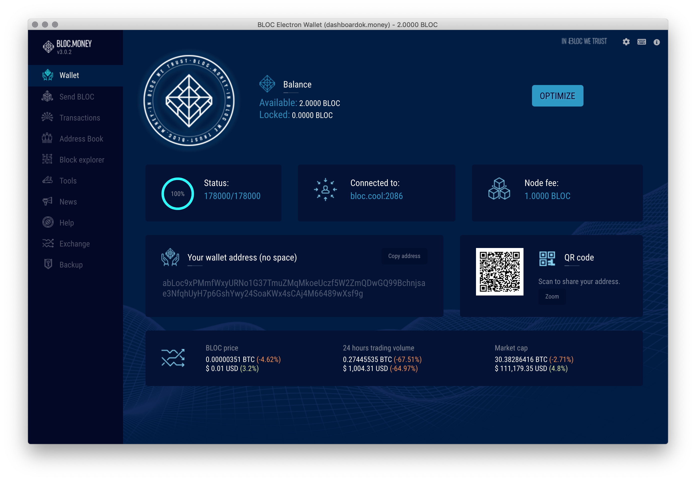
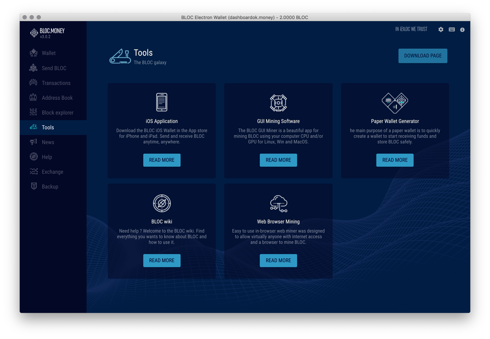
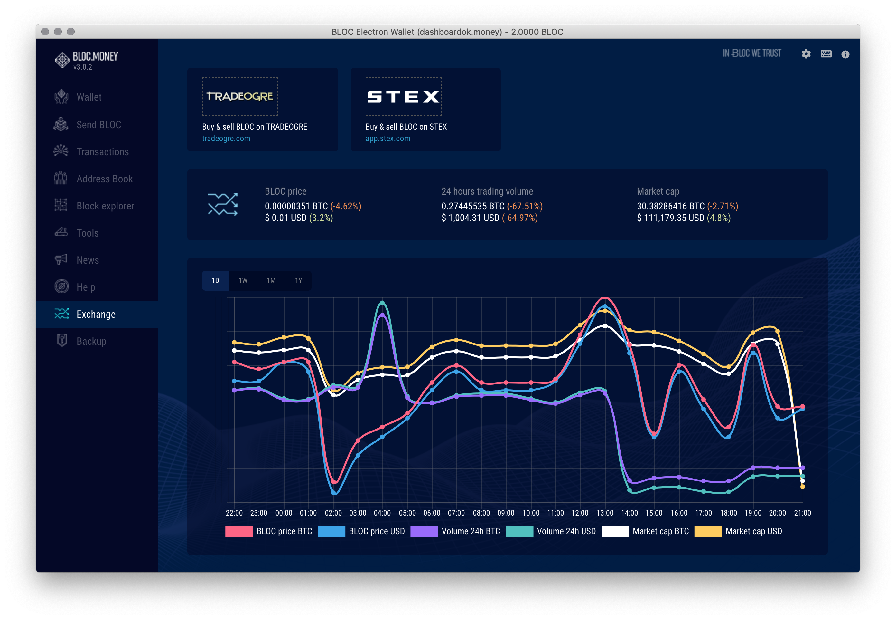

# BLOC Electron Wallet for Desktop

[BLOC Electron GUI Wallet](https://github.com/furiousteam/BLOC-electron-wallet) - GUI Stands for Graphical User Interface. It makes it easy for you to use BLOC with a friendly user interface. The BLOC Electron Wallet client allow you to create your wallet, store and send your [BLOC money](https://bloc.money), view your transactions and much more. BLOC Electron GUI Wallet is available for Windows, macOS and linux desktop and laptop computers.

## **Screenshot**








## Features:
This wallet contains the basic functions required to manage your BLOC assets:

* Wallet creation
  * Create new wallet
  * Import from private keys OR mnemonic seed
* Basic wallet operation
  * Open an existing wallet
  * Display wallet address & balance
  * Display private keys/seed
  * Export private keys/seed
  * Transactions listing/sorting/searching
  * Display transaction detail
  * Export incoming, outgoing, or all transactions to csv file.
  * Incoming Transaction notification
  * Send BLOC to single recipient address, allow to set payment id and custom fee. Provides address lookup from addressbook.
  * Perform wallet optimization by creating fusion transactions
  * Provides utility to generate payment id and integrated address
* Address book
  * Add/Edit/Delete address entry (label/name, address and payment id)
  * Listing/sorting/searching existing entries
  * Allow to store same wallet address with different payment id
  * Autosave address after sending to new/unknown recipient
* Misc
  * Provides setting to set local or public node address
  * Option to use system tray (on closing/minimizing wallet)
  * Provides list of public nodes, fetch/updated daily from [BLOC-nodes-json](https://github.com/furiousteam/BLOC-nodes-json) repo.
  * Custom node address that is not on the list will be added/remembered for future use
  * [Keyboard shortcuts](docs/shortcut.md)


### Notes

BLOC-electron-wallet relies on `BLOC-service` to manage wallet container &amp; rpc communication.

Release installer & packaged archives includes a ready to use `BLOC-service` binary, which is unmodified copy BLOC release archive.

On first launch, BLOC-electron-wallet will try to detect location/path of bundled `BLOC-service` binary, but if autodetection failed, you can manually set path to the `BLOC-service` binary on the Settings screen.

If you don't trust the bundled `BLOC-service` file, you can compare the checksum (sha256sum) against one from the official release, or simply download and use the binary from official BLOC release, which is available here: https://github.com/furiousteam/BLOC/releases. Then,  make sure to update your `BLOC-service` path setting.

### Download &amp; Run BLOC Electron Wallet

#### Windows:
1. Download the latest installer here: https://github.com/furiousteam/BLOC-electron-wallet/releases
2. Run the installer (BLOC-Electron-Wallet-<version>-win-setup.exe) and follow the installation wizard.
3. Run as Administrator BLOC-Electron-Wallet via start menu or desktop shortcut. (right click on the app icon and select run as Administrator)

#### GNU/Linux (AppImage):
1. Download latest AppImage bundle here: https://github.com/furiousteam/BLOC-electron-wallet/releases
2. Make it executable, either via GUI file manager or command line, e.g. `chmod +x BLOC-Electron-Wallet-<version>-linux.AppImage`
3. Run/execute the file, double click in file manager, or run via shell/command line.

See: https://docs.appimage.org/user-guide/run-appimages.html

#### macOS
1. Download latest archive here: https://github.com/furiousteam/BLOC-electron-wallet/releases
2. Extract downloaded zip archived into your home folder
3. Open terminal and Run: `cd /Users/YOURNAME/BLOC-Electron-Wallet.app/Contents/MacOS && ./BLOC-Electron-Wallet`

### Build
You need to have `Node.js` and `npm` installed, go to https://nodejs.org and find out how to get it installed on your platform.

Once you have Node+npm installed:
```
# first, download BLOC-service binary for each platform
# from BLOC.MONEY official repo
# https://github.com/furiousteam/BLOC/releases
# extract the BLOC-service executable somewhere

# clone the repo
$ git clone https://github.com/furiousteam/BLOC-electron-wallet
$ cd BLOC-electron-wallet

# install dependencies
$ npm install

# create build+dist directory
$ mkdir -p ./build && mkdir -p ./dist

# copy/symlink icons from assets, required for packaging
$ cp ./src/assets/icon.* ./build/

# build GNU/Linux package
$ mkdir -p ./bin/lin
$ cp /path/to/linux-version-of/BLOC-service ./bin/lin/
$ npm run dist-lin

# build Windows package
$ mkdir -p ./bin/win
$ cp /path/to/win-version-of/BLOC-service.exe ./bin/win/
$ npm run dist-win

# build OSX package
$ mkdir -p ./bin/osx
$ cp /path/to/osx-version-of/BLOC-service ./bin/osx/
$ npm run dist-mac
```

Resulting packages or installer can be found inside `dist/` directory.

### Porting for other coin
Please see [this guide](docs/porting.md) if you want to adapt BLOC-electron-wallet to be use for your own BLOC fork.
